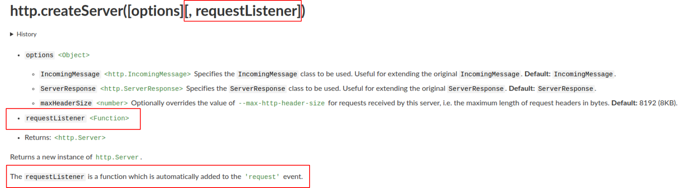
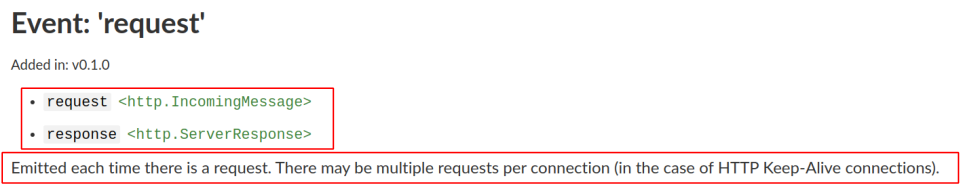
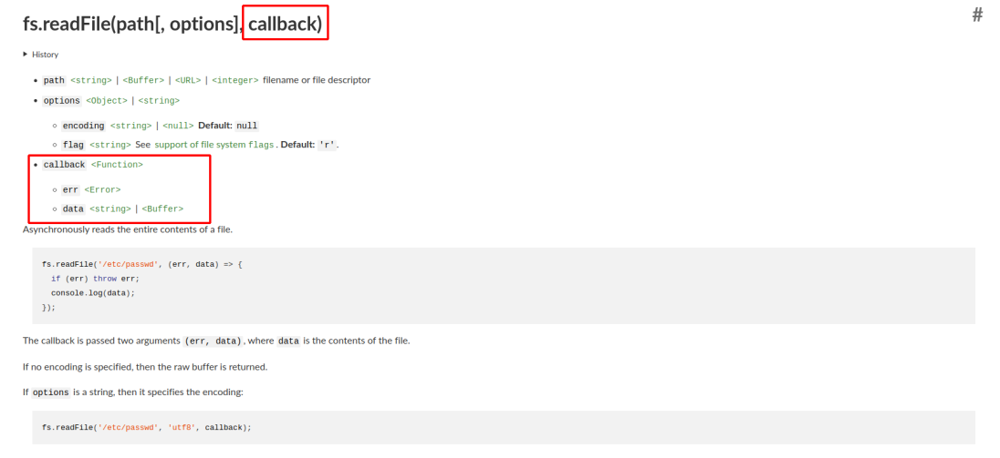

## PRESENTATION

NodeJS est un environnement d'execution Javascript basé sur le moteur Javascript Chrome V8.

Lien vers tutoriel Javascript : [Javascipt Openclassrooms](https://openclassrooms.com/fr/courses/2984401-apprenez-a-coder-avec-javascript)
Lien vers tutoriel NodeJS : [NodeJS Openclassrooms](https://openclassrooms.com/fr/courses/1056721-des-applications-ultra-rapides-avec-node-js)

Il permet d'exécuter du Javascript en dehors du navigateur.
Il ouvre la possibilité d'exécuter du Javascript coté serveur.

Ce qui fait la performance de NodeJS :

* **base sur le moteur d'execution V8 de Chrome qui analyse et execute le code très rapidement (compilation JustInTime)**
* **Javascript => code non bloquant (naturellement asynchrone) basé sur la notion d'évènement *(gros avantage mais necessaire de bien intégrer la notion de Callback et de de Promise)***

## PREPARATION DE L'ENVIRONNEMENT DE TEST

Au lien suivant, télécharger le Current : https://nodejs.org/en/

### PREPARER L'ENVIRONNEMENT SOUS LINUX

#### INSTALLER NODEJS (en manuel)

1. Telecharger l'archive node-vXX.XX.XX-linux-x64.tar.xz
Dans le terminal :
2. Décompresser l'archive:
   `tar -xGf node-vXX.XX.XX-linux-x64.tar.xz`
3. Se positionner dans le dossier node:
   `cd node-vXX.XX.XX-linux-x64`
4. Faire l'installation (la commande va copier toute l'arborescence sur dossier dans /usr):
   `sudo cp -R * /usr/`
5. Controler l'installation dans le terminal:
   `node -v`
   `npm -v`

### PREPARER L'ENVIRONNEMENT SOUS WINDOWS

#### INSTALLER NODEJS
1. Télécharger l'executeur d'installation node-vXX.XX.XX-linux-x64.msi(.exe)
2. Lancer l'executeur d'installation
3. Controler l'installation dans le terminal:
   `node -v`
   `npm -v`

#### INSTALLER CURL
1. Télécharger [CURL pour Windows](https://curl.haxx.se/windows/dl-7.68.0/curl-7.68.0-win64-mingw.zip)
2. Décompresser l'archive dans le dossier de votre choix.
3. Ajouter le lien vers le dossier dans le PATH (variable d'environnement...).

### COMMANDE NODEJS DISPONIBLES

* node => **Moteur d'execution Javascript**
* npm => **Gestionnaire de paquet NodeJS**

### MISE A JOUR NODEJS/ADMINISTRATION

Pour la mise à jour de NodeJS perso j'utilise le module ***n*** (Node version management [tj/n sur GitHub](https://github.com/tj/n)):

1. Installation de ***n*** : `sudo npm install -g n`
2. Mise à jour de NodeJS : `sudo n stable` ou `sudo n lts` ou  `sudo n latest`
3. Admnistration : `sudo n` (ouvre une interface pour supprimer ou selectionner les version de NodeJS)

Documentation du module ***n*** : [Doc sur n](https://www.npmjs.com/package/n)

## SERVEUR WEB STANDARD VS SERVEUR WEB NODEJS

### SERVEUR WEB STANDARD

Pour créer un site web dynamique on associe un moteur d'exécution PHP avec un serveur web HTTP Apache ou Nginx.
Les rôles sont partagés:

* Apache gère les connexions (in/out), associant un processus (thread) à chaque client.
* PHP exécute les script des pages dynamiques .php, transmet le résultat à Apache qui l'envoi au client.

### SERVEUR WEB NODEJS

Dans le cas de NodeJS on n'utilise pas de serveur web HTTP tiers, nous créons le serveur gérant l'ensemble des fonctionnalités.
De plus NodeJS est monothread (un seul processus à la fois), mais son coté orienté évènement (langage non bloquant) le rend très performant (il est constamment en action).

## MON PREMIER SERVEUR NODEJS

### CONSTRUCTION DU SERVEUR

1. Création du fichier ***main_http_server.js***:

```javascript
 //j'importe la librairie http
 var http = require('http');

 //je créé mon serveur
 var server = http.createServer(function(request,response)
 {
 //ENVOI TEXTE
 //Dans le header : ajout du status 200(=>OK) et type MIME des data envoyées
 response.writeHead(200, {"Content-Type": "text/plain"});
 answer = 'HELLO WORD !'
 //

response.end(answer); //envoi du résultat avec la variable answer dans le body
 });

//j'écoute sur le port 8080
 server.listen(8080)
```

2. Lancement du serveur :
   `node main.js`

3. Contrôle du résultat :
* Dans le navigateur : http://localhost:8080
* Dans le terminal via **curl** : `curl -X GET localhost:8080`

### PAGE HTML OU REST API

> **Liens utiles (documentation Mozilla):**
>
> * [Status HTTP](https://developer.mozilla.org/fr/docs/Web/HTTP/Status)
> * [Types MIME](https://developer.mozilla.org/fr/docs/Web/HTTP/Basics_of_HTTP/MIME_types)    

#### ENVOI DU RESULTAT EN HTML

***pour une visualisation dans un navigateur***

*Modification du fichier main_http_server.js* :

```javascript
///ENVOI HTML
response.writeHead(200, {"Content-Type": "text/html"});
answer = `<!DOCTYPE html>
<html>
  <head>
    <meta charset="utf-8" />
    <title>Liste de courses</title>
  </head>
  <body>
    <p>Liste de courses :
    <ul>
      <li>PAIN</li>
      <li>FRUITS</li>
      <li>LEGUMES</li>
    </ul>
    </p>
  </body>
</html>`
//
```

#### ENVOI DU RESULTAT EN JSON : REST API

***Pour une utilisation dans une application tierce***

*Modification du fichier main_http_server.js* :

```javascript
//ENVOI JSON
response.writeHead(200, {"Content-Type": "application/json"});
answer = JSON.stringify({"courses" : ["PAIN", "FRUITS", "LEGUMES"]});
//
```

### EXERCICE  : CREER SERVEUR HYBRIDE

Le but de l'exercice est de créer un serveur qui renvoi le résultat sous format HTML ou JSON en fonction de la requête envoyée.

Pour adapter la réponse du serveur en fonction de la requête mais il faut trouver le moyen de l'analyser ?

**Comme souvent la réponse est dans la documentation !!**

> Liens utiles (documentation NodeJS : module http):
>
> * [Function: http.createServer()](https://nodejs.org/api/http.html#http_http_createserver_options_requestlistener)
> * [Event: 'request'](https://nodejs.org/api/http.html#http_event_request)
> * [Class: http.IncomingMessage](https://nodejs.org/api/http.html#http_class_http_incomingmessage)
> * [Class: http.ServerResponse](https://nodejs.org/api/http.html#http_class_http_serverresponse)

#### Documentation de  ***http***

##### Premièrement : [Function: http.createServer()](https://nodejs.org/api/http.html#http_http_createserver_options_requestlistener)



On identifie que la fonction passé à la méthode ***createServer*** correspond au paramêtre ***requestListener***.
La dernière phrase indique que la fonction requestListener est intégré à l'event ***'request'***

##### Deuxièmenent : [Event: 'request'](https://nodejs.org/api/http.html#http_event_request)



On peut lire que cet event est levé a chaque fois qu'une requête est soumise.
Les deux paramêtres, ***request*** et ***response*** sont passés à la fonction ***requestListener*** :

* request est un objet [http.IncomingMessage](https://nodejs.org/api/http.html#http_class_http_incomingmessage), il représente la requête reçue par le serveur.
* response est un objet [http.ServerResponse](https://nodejs.org/api/http.html#http_class_http_serverresponse), il représente la réponse renvoyée par le serveur.

Donc a partir de la documentation, je peux déduire que les informations qui me permettrait d'adapter la réponse du serveur à la requête utilisateur sont contenues dans l'objet ***http.IncomingMessage***.

#### Expérimentations :

> Lien utile :
>
> * Documentation NodeJS :
>   * [message.headers](https://nodejs.org/api/http.html#http_message_headers)
>   * [message.url](https://nodejs.org/api/http.html#http_message_url)
> * Documentation Mozilla :
>   * [Headers](https://developer.mozilla.org/fr/docs/Web/HTTP/Headers)
>   * [Accept](https://developer.mozilla.org/fr/docs/Web/HTTP/Headers/Accept)

##### Solution 1 : [message.headers](https://nodejs.org/api/http.html#http_message_headers)

Dans une requête HTTP, le **[header](https://developer.mozilla.org/fr/docs/Web/HTTP/Headers)** sert à transférer des informations précises en complément du corps de la requête.

###### Visualisons le ***message.header*** :

1. ajout dans le serveur :`console.log(request.headers)`
2. commande dans un terminal : `curl -X GET localhost:8080`
3. résultat :

```json
{
  host: 'localhost:8080',
  'user-agent': 'curl/7.55.1',
  accept: '\*/\*'
}
```

> Analyse : Dans cet exemple, le paramêtre **[accept](https://developer.mozilla.org/fr/docs/Web/HTTP/Headers/Accept)** est important, il permet au client d'indiquer au serveur quels types de contenus il sera capable d'interpréter.
> Cet info est exprimé sous la forme de types MIME (ex : text/html, application/json ...).

4. ajout d'un paramètre ***accept*** dans le curl : `curl -X GET localhost:8080 -H "accept:application/json"`
5. résultat :

```json
{
  host: 'localhost:8080',
  'user-agent': 'curl/7.55.1',
  accept: 'application/json'
}
```

6. ajout de plusieurs paramètre ***accept*** dans le curl : `

   `curl -X GET localhost:8080 -H "accept:text/html, application/json"`

7. résultat :

```json
{
  host: 'localhost:8080',
  'user-agent': 'curl/7.55.1',
  accept: 'text/html, application/json'
}
```

###### Développons la solution :

```javascript
var server = http.createServer(function(request,response)
{
    var awswer = '';

    //je recupere la valeur de parametre accept au format string
    var acceptValue = request.headers.accept;

    //je supprime les espace dans la chaine de caractère
    acceptValue = acceptValue.replace(/\s/g,'');

    //je split la chaine pour obtenir une liste de MIME
    var acceptMimes = acceptValue.split(',');

    //Si un des parametre est application/json, je renvoi une reponse au format JSON
    if (acceptMimes.includes('application/json'))
    {
      response.writeHead(200, {"Content-Type": "application/json"});
      answer = JSON.stringify({"courses" : ["PAIN", "FRUITS", "LEGUMES"]});
    }
    //sinon je renvoi une réponse au format html
    else {
      response.writeHead(200, {"Content-Type": "text/html"});
      answer = `<!DOCTYPE html>
      <html>
        <head>
          <meta charset="utf-8" />
    '     <title>Liste de courses</title>
        </head>
        <body>
          <p>Liste de courses :
          <ul>
            <li>PAIN</li>
            <li>FRUITS</li>
            <li>LEGUMES</li>
          </ul>
          </p>
        </body>
      </html>`
    }
    response.end(answer);
});
```

##### Solution 2 : [message.url](https://nodejs.org/api/http.html#http_message_url)

L'URL d'une requête permet d'identifier une ressource du web, elle peut donc nous permettre d’accéder soit a la page HTML soit à l'API.

###### Visualisons le ***message.url***

1. ajout dans le serveur : `console.log(request.url)`
2. commande dans un terminal : `curl -X GET localhost:8080/liste`
3. resultat : `/liste`
4. commande dans un terminal : `curl -X GET localhost:8080/api/liste`
5. resultat : `/api/liste`

###### Développons la solution :

```javascript
var server = http.createServer(function(request,response)
{
  var answer = '';
  //je recupere l'url via l'objet message.url
  var url = request.url;

  // j'utilise une structure conditionnelle switch pour adapter la réponse à l'url
  switch(url)
  {
    //si l'url == index je renvoi du html
    case '/index':
      response.writeHead(200, {"Content-Type": "text/html"});
      answer = `<!DOCTYPE html>
      <html>
        <head>
          <meta charset="utf-8" />
    '     <title>Liste de courses</title>
        </head>
        <body>
          <p>Liste de courses :
          <ul>
            <li>PAIN</li>
            <li>FRUITS</li>
            <li>LEGUMES</li>
          </ul>
          </p>
        </body>
      </html>`
      break;
    // si l'url == /api/list je renvoi du json
    case '/api/liste':
      response.writeHead(200, {"Content-Type": "application/json"});
      answer = JSON.stringify({"courses" : ["PAIN", "FRUITS", "LEGUMES"]});
      break;
    // si l'url ne correspond a aucun des 2 il envoi un code 404
    default:
      response.writeHead(404);
  }
  response.end(answer);
});
```

## EVENTS ET CALLBACKS

Une application NodeJS fonctionne sur un seul Thread, mais aucune opération n'est bloquante.
Donc chaque opération "longue" (requête HTTP, lecture/écriture fichier ...) est lancée en tache de fond laissant la suite du code s’exécuter.

Ce mode de fonctionnement font la puissance mais aussi la complexité de l'environnement.
Comment récupérer et agir en fonction du résultat d'une opération "longue" ?
C'est là que la notion de **event** et de **callback** entre en jeu.

### LES EVENTS

Les events sont la base de NodeJS, dans cet environnement d'execution non bloquant, ils nous permettent de cadencer l’exécution de notre code.

#### LES EVENTS CLIENT SIDE

> Lien utiles:
>
> * [HTML Event attribute - W3S](https://www.w3schools.com/tags/ref_eventattributes.asp)
> * [JavaScript Events - W3S](https://www.w3schools.com/js/js_events.asp)
> * [HTML DOM Events - W3S](https://www.w3schools.com/jsref/dom_obj_event.asp)
> * [HTML DOM Element Object](https://www.w3schools.com/JSREF/dom_obj_all.asp)
> * [HTML DOM addEventListener()](https://www.w3schools.com/jsref/met_element_addeventlistener.asp)

Les premier events souvent étudiés et utilisés sont ceux utilisés dans une page HTML (client side), on peut les attacher à un élément en utilisant :

1. Un [Event attribute](https://www.w3schools.com/tags/ref_eventattributes.asp) dans la balise HTML.
2. La fonction [addEventListener()](https://www.w3schools.com/jsref/met_element_addeventlistener.asp) dans un script.

##### 1. Event Attribute :

Code :

```html
<p onmouseover="onOver()" onmouseout="onOut()" style="background-color:red;display:inline-block;padding:20px;color:white;font-weight:bold;cursor:pointer;">SURVOLER AVEC LA SOURIS</p>
<p id="test_event" style="font-weight:bold;display:inline-block;"></p>
<script>
function onOver(msg)
{
   document.getElementById("test_event").innerHTML = "==> SURVOL DE L'ELEMENT";
}
function onOut()
{
  document.getElementById("test_event").innerHTML = "";
}
</script>
```

[Visu du résultat](./html_event.html)

En déclarant l'[Event attribute](https://www.w3schools.com/tags/ref_eventattributes.asp) ***onmouseover*** sur l'élément HTML j'attache cet event à l'élément.
La fonction passé en valeur de l'attribut est la fonction exécutée lorsque l'event est levé.
Même fonctionnement pour l'attribut ***onmouseout***.

##### 2. La fonction ***addEventListener()***

Code:

```html
<p id="root_event_2" style="background-color:red;display:inline-block;padding:20px;color:white;font-weight:bold;cursor:pointer;">SURVOLER AVEC LA SOURIS</p>
<p id="target_event_2" style="font-weight:bold;display:inline-block;"></p>
<script>
  function onOver2()
  {
    document.getElementById("target_event_2").innerHTML = "==> SURVOL DE L'ELEMENT";
    console.log('error');
  }
  function onOut2()
  {
    document.getElementById("target_event_2").innerHTML = "";
  }

  document.getElementById("root_event_2").addEventListener('mouseenter', onOver2);
  document.getElementById("root_event_2").addEventListener('mouseleave', onOut2);
</script>
```

[Visu du résultat](./html_event.html)

Avec la methode [addEventListener()](https://www.w3schools.com/jsref/met_element_addeventlistener.asp) de l'objet [DOM Element](https://www.w3schools.com/JSREF/dom_obj_all.asp) réprésentant l'élément HTML avec l'id "root_event_2", j'attache le [DOM Event HTML](https://www.w3schools.com/jsref/dom_obj_event.asp) ***mouseenter*** à cet élément, lorsque cet event est levé, la fonction onOver2() est executée.
Même fonctionnement pour l'attribut ***mouseleave***.

Cette solution se rapproche beaucoup de celle utilisé dans NodeJS.

 Concrètement la formulation dans NodeJS est identique à la formulation du framework JQuery  :
 `$(root_event_2).on('mouseenter', onOver2)`

#### LES EVENTS DANS NODEJS

Donc dans NodeJS, la syntaxe pour attacher une fonction à un event est la suivante :

`myemitter.on('event', myfunction);`

Comme la plupart des langageS de programmation, le système d'Event (Handler) de NodeJS fonctionne sur un système de **publish-subscribe**.
Ci dessus, via la fonction **on()**, on ajoute un nouvel éléments _"myfunction"_ dans la liste des objets à l'écoute de la publication _"event"_ de notre **EventEmitter** _"myemitter"_.

La liste des éléments à l'écoute de l'event peut être récupérée via la fonction ***listeners(event)***:
`myemitter.on('event', myfunction);`

##### Dans notre serveur : le _request_ event

Lors des expérimentations effectuées précédement sur notre serveur Web la notion d'event a été survolé
Rappel du code utilisé pour la création du serveur:

```javascript
var server = http.createServer(function(request,response)
{
  var awswer = '';

  response.writeHead(200, {"Content-Type": "text/plain"});
  answer = 'HELLO WORD !'

  response.end(answer);
});
server.listen(8080);
```

Rappel de la documentation de [http.createServer()](https://nodejs.org/api/http.html#http_http_createserver_options_requestlistener) :


La documentation nous précise que la fonction passée en paramètre de createServer() est ajouté automatiquement à la liste des élément à l'écoute de l'event [request](https://nodejs.org/api/http.html#http_event_request) de [http.Server](https://nodejs.org/api/http.html#http_class_http_server).

On peut donc en déduire que le code utilisé précédemment est une compression du code suivant :

```javascript
var server = http.createServer();

server.on('request', function(request,response)
{
  var awswer = '';

  response.writeHead(200, {"Content-Type": "text/plain"});
  answer = 'HELLO WORD !'

  response.end(answer);
});

server.listen(8080);
```

##### Exercice : le _close_ event

> Lien utile:
> * [message.url](https://nodejs.org/api/http.html#http_message_url)
> * [http.close()](https://nodejs.org/api/http.html#http_server_close_callback)
> * [http close Event](https://nodejs.org/api/http.html#http_server_close_callback)


Ajoutons une fonction sur un autre event émis par http.Server, le [http Close Event](https://nodejs.org/api/http.html#http_event_close).
A la reception d'une requete sur l'url ***/close*** notre serveur doit se fermee, afficher un message de cloture dans la console serveur et envoyer un message au client pour confirmer la fermeture.

###### [Une solution possible](./http_server_close_event.js)

###### [Une solution possible version compact](./http_server_close_event_comp.js)

#### NOS EVENTS PERSO

##### Procédure

Tous les event héritent d'un objet natif de NodeJS, [EventEmitter](https://nodejs.org/api/events.html#events_class_eventemitter), il faut donc importer la librairie pour les utiliser.
`const EventEmitter = require('events').EventEmitter;`

Je peux ensuite creer un EventEmitter :
`var myeventEmitter = new EventEmitter();`

Puis créer des events et leur associer une action :

    myeventEmit.on('event1', function(message)
    {
      console.log('event1 emis');
      console.log('message transmis : ' + message);
    });

Et enfin emmètre l'event dans mon code :
` myeventEmit.emit('event1')`

##### Exercice : créer un logger avec un event

> Liens utiles :
>
> * [Events.EventEmitter()](https://nodejs.org/api/events.html#events_class_eventemitter)
> * [fs.appendFile()](https://nodejs.org/api/fs.html#fs_fs_appendfile_path_data_options_callback)
> * [HTTP Forbidden Status](https://developer.mozilla.org/fr/docs/Web/HTTP/Status/403)

Créons une fonction de log qui enregistre tous les url des requêtes reçues par le service dans un fichier ***logfile***. Mais ce logger dois enregistrer une alerte quand le client essai de se connecter à l'url interdit : ***/forbidden***.

J'ai besoin de 2 types de messages minimum:

* type INFO
* type WARNING
  Mon serveur renvoi un message (au choix au client) avec un status HTTP OK pour chaque url sauf pour l'url interdit, dans ce cas il doit renvoyer un status HTTP Forbidden.

###### [Une solution possible](./http_server_event_logger.js)

### LES CALLBACKS

Une ***fonction de callback*** est une fonction _(fille)_ passée en paramêtre d'une autre fonction _(mère)_ pour être appelé à la fin de son exécution.
Ce système de _callback_ permet :

1. d'executer une action à la fin d'une fonction asynchrone "longue" pour agir sur son résultat
2. d'élaborer des fonctions acceptant des fonction anonymes pour une plus grande modularité.

#### 1. Fonction asynchrone : lecture de fichier

> Lien utile :
>
> * [fs.readFile()](https://nodejs.org/api/fs.html#fs_fs_readfile_path_options_callback)

##### Lecture de la documentation



Dans la liste des parametres de la fonction asynchrone **readFile()** de **fs** un argument **callback** représentant une fonction est identifié.
2 paramêtres sont passés en arguments de cette fonction, ils représentent des données definies pendant l'execution de la fonction **readFile** :

* Error : erreur levé pendant la lecture du fichier, null si pas d'erreur identifiée
* String|Buffer : contenu du fichier.

La fonction de callback que l'on va passé en argument va nous permettre de récupérer et d'agir sur ces données.

##### Utilisation de fs.readFile()

```javascript
//import de la librairie file system.
const fs = require('fs');

//préparation d'une fonction qui affiche le contenu du fichier
function printContent(error, content)
{  
  if(!error)
  {
    //si le parametre error == null, pas d'erreur levé par readFile()
    console.log('contenu du fichier\n') //message d'introduction
    console.log(content); //affichage du contenu
    console.log("Fin du fichier"); //message de conclusion
  }
  else{
    console.log("error");
  }
}

/**
utilisation de la methode readFile pour lire le contenu du fichier
 argument :
     * path : lien vers le fichier
     * options : 'encodage désiré
     * function de callback : printContent
**/
fs.readFile('logfile', 'utf8', printContent);
```

##### Utilisation de fs.readFile() en version compacte

Je peux crée la fonction de callback directement en argument de readFile()

```javascript
fs.readFile('logfile', 'utf8', function(error, content)
{
  if(!error)
  {
    console.log('contenu du fichier\n') //message d'introduction
    console.log(content); //affichage du contenu
    console.log("Fin du fichier"); //message de conclusion
  }
  else{
    console.log("error");
  }
}
```

##### Utilisation de fs.readFile() en version compacte ++

Je peux utiliser la syntaxe ES6 : **fonction** disparait, remplacée par **=>**

```javascript
fs.readFile('logfile', 'utf8', (error, content)=>
{
  if(!error)
  {
    console.log('contenu du fichier\n') //message d'introduction
    console.log(content); //affichage du contenu
    console.log("Fin du fichier"); //message de conclusion
  }
  else{
    console.log("error");
  }
}
```

### 2. Fonctions anonymes

Le système de callback nous permet également de définir des fonctions générales dans les librairies en permettant à l'utilisateur final d'executuer la fonction de son choix sur le résultat.

#### Exemple 1 : la méthode [forEach() de Array](https://www.w3schools.com/jsref/jsref_forEach.asp)

```javascript
var total = 0;
var intTab = [1,2,3,4,5,6,7,8]

intTab.forEach(
//fonction callback
function(el)
{
    total+=el;
}
//fin fonction callback
);
```

#### Exemple 2 : la methode [on() de EventEmitter](https://nodejs.org/api/events.html#events_emitter_on_eventname_listener)

```javascript
const EventEmitter = require('events').EventEmitter;
var myeventEmitter = new EventEmitter();`
myeventEmit.on('event1',
//fonction de callback
function(message)
{
   console.log('event1 emis');
   console.log('message transmis : ' + message);
}//fin fonction de callback
);
```

#### Exemple 3 : ma methode custo

```javascript
/**
Fonction qui transforme un Array en Objet
**/
function toObj(array, callback)
{
    if(Array.isArray(array))
    {
        var obj={};
        for(var i=0; i<array.length; i++)
        {
            obj[i] = array[i]
          }
        callback(null, obj)
    }
    else
    {
        callback('error the argument is not an array');
    }
}

var a = ["momo","dede","lulu","jiji"]
toObj(a, function(error, obj){
    if(!error)
    {
        for(var key in obj)
        {
            console.log(`${key} -> ${obj[key]}`)
        }
    }
    else
    {
        console.log(error)
    }
 });   
```

#### Exercice : parser un url

> Liens utiles :
>
> * [Documentation Expression Reguliere](https://developer.mozilla.org/fr/docs/Web/JavaScript/Guide/Expressions_r%C3%A9guli%C3%A8res)
> * [Documentation RegEx](https://developer.mozilla.org/fr/docs/Web/JavaScript/Reference/Objets_globaux/RegExp)
> * [Documentation Array](https://developer.mozilla.org/fr/docs/Web/JavaScript/Reference/Objets_globaux/Array)
> * [Documentation String](https://developer.mozilla.org/fr/docs/Web/JavaScript/Reference/Objets_globaux/String)
> * [Parse Line argument](https://nodejs.org/en/knowledge/command-line/how-to-parse-command-line-arguments/)

Créons une commande qui va parser un url passer en paramètre et renvoyer une description de chaques élements de l'url.

Par Exemple, la commande :
`node monparser.js "http://example.com/link1/link2/link3?para1=value1&para2=value2"`

Doit renvoyer :

* le protocole : http ou https
* le domaine : example.com
* les éléments de routage : [link1,link2,link3]
* les paramètres : {para1:value1, para2:value2}

La fonction qui parsera l'url devra prendre une fonction de callback en argument.

###### [Une solution possible](./parse_url_exercice.js)

## LA GESTION DES ERREURS
> Lien utile:
> *[Gestion des erreur - W3S ](https://www.w3schools.com/js/js_errors.asp)

Une exception est un évènement bien particulier qui va interrompre le programme si il n'est pas correctement géré.
Donc la moindre petite exception non gérée peut supprimer l'accès au service pour les clients distants.

### LEVONS UNE ERREUR

```javascript
var owk = {'prenom':'Obi-Wan',
                'nom':'Kenobi',
                'profession':'Maitre Jedi',
                'eleve':{
                    'prenom':'Anakin',
                    'nom':'Skywalker',
                    'profession':'Jedi',
                    'eleve':null}
            };
var asw = owk.eleve;
console.log(asw.prenom);
var oj = asw.eleve;
console.log(oj.prenom);
console.log('fin du programme');
```

Nous obtenons :

```bash
Anakin
/home/florent/leve_exception.js:16
console.log(oj.prenom);
               ^

TypeError: Cannot read property 'prenom' of null
...

```

### LE BLOCK TRY/CATCH

Le bloc try/catch nous permet de récupérer les erreurs levée pendant l'execution' du code et de réagir en fonction.

``` javascript
var owk = {'prenom':'Obi-Wan',
                'nom': 'Kenobi',
                'profession':'Maitre Jedi',
                'eleve':{
                    'prenom':'Anakin',
                    'nom':'Skywalker',
                    'profession':'Jedi',
                    'eleve': null}
            };
try{
  //mon code qui peut éventuellement lever une erreur
  var asw = owk.eleve;
  console.log(asw.prenom);
  var oj = asw.eleve;
  console.log(oj.prenom);
}catch(e)
{
  //Code executé en cas d'erreur
  console.log("attention erreur suivante dans mon code "+e);
}finally
{
  // ce bloc est executé dans les 2 cas.
  console.log('fin du programme');
}

```

### LEVER UNE EXCEPTION AVEC THROW

Une exception est un erreur definie par le programmeur en fonction de ses besoin.
La commande **throw** nous permet de lever une exception, elle peut être utilisée n'importe où dans notre code.

``` JavaScript
function getOnlyLowerTen(nbr)
{
  if(nbr<10)
  {
    return 'Voici votre nombre :'+nbr;
  }
  else {
    throw 'le nombre est superieur à 10'
  }
}

console.log(getOnlyLowerTen(5));
console.log(getOnlyLowerTen(12));
```

### TYPER SON EXCEPTION

La commande throw nous permet également de renvoyer un objet Error ou toute variate héritant de cet objet.
Variante de l'objet Error :
* EvalError
* RangeError
* ReferenceError
* SyntaxError
* TypeError
* URIError

```Javascipt
function getOnlyLowerTen(nbr)
{
  if(nbr<10)
  {
    return 'Voici votre nombre :'+nbr;
  }
  else {
    throw new Error('le nombre est superieur à 10')
  }
}

console.log(getOnlyLowerTen(5));
console.log(getOnlyLowerTen(12));
```

### EXERCICE EXCEPTION

Nous allons modifier la fonction getOnlyLowerTen() pour typer l'erreur déjà émise et lever également une erreur typée si le paramètre n'est pas un nombre.
Ensuite nous préparerons un code simple qui exécutera la fonction en gérant les éventuelles erreurs levées.
Cette fonction devra adapter son comportement en fonction du type d'erreur levée.

[Une solution possible](./error_exercice.js)


## LES PROMISES

> Lien utile :
> * [Promise - Mozilla](https://developer.mozilla.org/fr/docs/Web/JavaScript/Reference/Objets_globaux/Promise)

Comme les callbacks, les **Promises** (promesses) permettent de gérer l'execution asynchrone imposé par le Javascript.  
Ils sont plus récent et légèrement plus complexe que les callbacks mais elles sont aussi plus puissantes et plus facile à lire.

Le principe consiste à déclarer un objet qui représente la complétion (resolve) ou l'échec (reject) d'une operation.

On le retourne généralement à l'appel d'une fonction asynchrone.
Le promise recupéré nous permet d'agir sur le resultat via sa fonction **.then()** en cas de succès ou via **.catch** en cas de défaut.  

Voila ce que ça peut donner si on l'applique sur le même exemple que celui utilisé sur le callback :

```javascript
//fonction asynchrone
function toObj(array)
{
  //je renvoi un promise
  return new Promise((resolve, reject)=>
  {
    if(Array.isArray(array))
    {
        var obj={};
        for(var i=0; i<array.length; i++)
        {
            obj[i] = array[i]
          }
        //pas d'erreur a lever
        //appel de la fonction resolve sur le resultat de la fonction
        resolve(obj)
    }
    else
    {
        // appel de la fonction reject en cas d'erreur
        reject(new Error('error the argument is not an array'));
    }
  });
}

var a = ["momo","dede","lulu","jiji"];
//var a = "obiwan"

//appel de la fonction asynchrone toObj, elle retourne un Promise
toObj(a)
  .then((obj)=> 
  {
    //appel de la fonction contenue dans then en cas de succes 
    for(var key in obj)
    {
      console.log(`${key} -> ${obj[key]}`);
    }
  })
  .catch((err)=>
  {
    //appel de la fonction contenue dans catch en cas d'erreur
    console.log(err);
  });

```

Un des gros avantage des Promises est le chainage.
Les fonction **.then()** et **.catch()** renvoie elles même une Promise ce qui nous permet de chainer les actions afin de s'adapter au résultat envoyé par la fonction d'appel.

```javascript
var fs = require('fs')

//declaration de la fonction asynchrone
function getContent(file)
{
  return new Promise((resolve, reject)=>
  {
      fs.readFile(file, (error, content)=>
      {
        if(!error)
        {
          resolve(content);
        }
        else
        {
          reject(error);
        }
      });
  });
}

getContent('html_event.html')
  .then((res)=>
  {
    //en cas de succes je retourne le resultat pour la dernière promise de la chaine 
    return res
  })
  .catch((rej)=>
  {
    //en cas de défaut j'affiche un message d'erreur
    console.log("Error\n"+rej.message+"\nInitialisation du contenu par défaut");
    // et je retourne une valeur par défaut (NO CONTENT)
    return "NO CONTENT"
  }).then((res)=>
  {
    //j'affiche le resultat
    // NO CONTENT en cas de défaut, et le contenu du fichier si aucune erreur levée
    console.log("Affichage du contenu :\n"+res)
  });

```

Les autres fonctions de Promise permettent de construire une Promise contenant plusieurs autre Promises :
* la fonction **.all()**
* la fonction **.race()**

**fonction all()**

La Promise _racine_ est résolue seulement si toutes les Promises contenues sont résolue, sinon elle est rejetée.

```javascript
var fs = require('fs')

Promise.all(
  [fs.promises.readFile('html_event.html'),
  fs.promises.readFile('testfile.txt')]
)
.then((res)=>
{
  console.log(res.toString());
})
.catch((err)=>
{
  console.log(err);
})
```

**fonction run()**

La Promise _racine_ est résolue dès qu'une des Promises contenues est résolue.

```javascript
var fs = require('fs')

Promise.race(
  [fs.promises.readFile('html_event.html'),
  fs.promises.readFile('testfile.txt')]
)
.then((res)=>
{
  console.log(res.toString());
})
.catch((err)=>
{
  console.log(err);
})
```

### NOUVEAUTE ES7 : ASYNC / AWAIT

Comme les callback et les Promises, les mots clés **async** et **await** permettent la gestion du code asynchrone.

Le principe consiste déclarer des fonctions asynchrones taggées avec le mot clé **async**.  
On peut ensuite la possibilité de figer l'execution du code en attendant le retour de ces fonction avec le mot clé **await**

```javascript
var fs = require('fs')

async function readFile(file)
{
  return fs.promises.readFile(file)
}

async function displayConcatFile(fileArray)
{
  var str=''; 
  for(var f of fileArray)
  {
    await readFile(f)
      .then((res)=>
      {
        str+=res.toString()+"\n\n"
      })
      .catch((err)=>
      {
        console.log(err)
      });
  }
  console.log(str)
}

displayConcatFile(['testfile2.txt', 'testfile.txt'])

```


